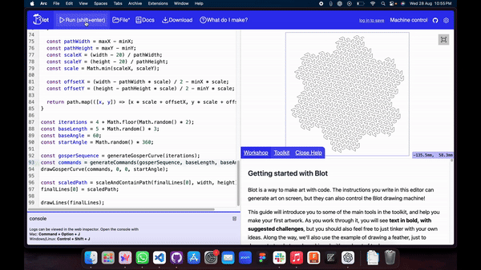

## Generative Gosper Curve Art

### Introduction

This project generates unique instances of Gosper curves using a simple L-System implementation in JavaScript. The Gosper curve is a type of space-filling fractal curve, often used in generative art due to its complex, organic patterns. This script leverages randomization to create varied and visually interesting patterns each time the code is run, ensuring that each output is unique.

### What is a Gosper Curve?

The Gosper curve, also known as the flowsnake, is a type of fractal curve. It is generated using an L-System (Lindenmayer System), which is a parallel rewriting system commonly used to model the growth of plants and other natural phenomena. The Gosper curve is known for its hexagonal structure and intricate, self-similar patterns.

#### L-System Rules for the Gosper Curve

An L-System consists of:
- **Axiom**: The initial string from which the system begins.
- **Rules**: Rewriting rules that replace characters in the string with other strings.

For the Gosper curve, the rules are:
- `A -> A-B--B+A++AA+B-`
- `B -> +A-BB--B-A++A+B`

Starting with the axiom `A`, these rules are applied iteratively to generate the sequence that defines the Gosper curve.

### How the Code Works

The script follows these steps to generate and render a unique Gosper curve each time:

1. **Set Document Dimensions**: The canvas dimensions are set to 400x400 pixels.
2. **Generate Gosper Curve Sequence**: An L-System generates a string sequence based on the Gosper curve rules. The number of iterations is randomized between 4 and 5, which controls the complexity of the curve.
3. **Convert Sequence to Drawing Commands**: The generated string sequence is translated into drawing commands. These commands include moving forward by a certain length and turning by a specific angle.
4. **Randomize Parameters**: 
   - The length of each segment (`baseLength`) is randomized between 5 and 8 units.
   - The starting angle (`startAngle`) is randomized between 0 and 360 degrees.
5. **Draw the Gosper Curve**: The drawing commands are executed to create a path representing the Gosper curve. This path is then scaled and centered to fit within the canvas.
6. **Render the Curve**: The final curve is drawn on the canvas.

### Generative Art Parameters

Generative art refers to art that is created through an algorithm or system that can produce multiple variations, often with some level of randomness or procedural generation. In this project, the Gosper curve is rendered uniquely each time the script is run due to the following factors:

- **Randomized Iterations**: The number of iterations of the L-System can change, which affects the complexity of the curve.
- **Randomized Segment Length**: The length of the lines in the curve varies, leading to different visual densities and patterns.
- **Randomized Start Angle**: The entire curve can be rotated to start at a different angle, adding variety to the orientation and overall appearance.

### Conclusion

This project demonstrates how the combination of mathematical fractals and randomization can create compelling generative art. The Gosper curve's intricate patterns, when paired with randomized parameters, result in a diverse array of visually interesting outputs, each distinct from the last.